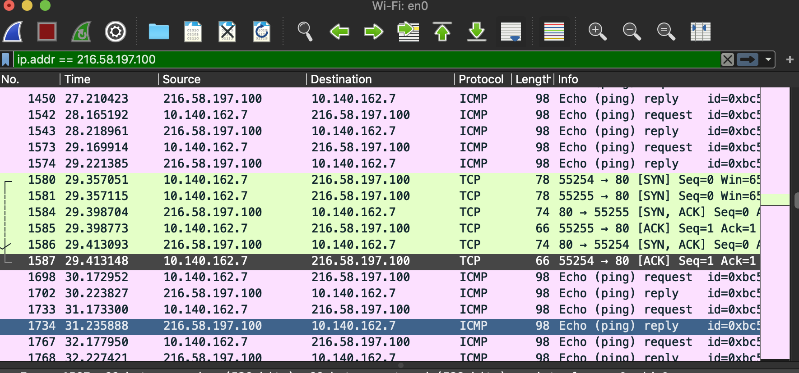

# Quest 09. What is Server

2020. 01. 28

## Topics

### 1. Server, Client, Web Browser

클라이언트 / 서버는 두 개의 컴퓨터 프로그램 사이에 이루어지는 역할 관계를 나타내는 것이다.

* 클라이언트 : 다른 프로그램에게 서비스를 요청하는 프로그램 / 시스템
* 서버 : 요청에 대해 응답, 서비스를 제공 해주는 프로그램 / 시스템
* 웹 브라우저 : 인터넷 상 어딘가에 위치한 웹 서버에게 웹페이지나 파일의 전송을 요구하는 클라이언트 프로그램

### 2. Protocols

통신 프로토콜은 서로 다른 기기들 간의 데이터 교환을 원활하게 수행할 수 있도록 표준화시켜 놓은 통신 규약이다. 통신 프로토콜은 통신을 제어하기 위한 표준 규칙과 절차의 집합으로 하드웨어와 소프트웨어 문서를 모두 규정한다.

인터넷을 사용하기 위한 프로토콜은 TCP/IP (Transport Controll Protocol / Internet Protocol)

통신 프로토콜의 기본 요소는 3가지로 구성되는데

* 구문 : 전송하고자 하는 데이터의 형식, 부호화, 신호 레벨등을 규정한다
* 의미 : 두 기기 간의 효율적이고 정확한 정보 전송을 위한 협조 사항과 오류 관리를 위한 제어 정보를 규정한다.
* 시간 : 두 기기 간 통신속도, 메시지 순서 제어 등을 규정한다.

#### 1) IP

* 송신 호스트와 수신 호스트가 패킷 교환 네트워크에서 정보를 주고받는데 사용하는 정보 위주의 규약.
* 각 패킷의 주소 부분을 처리(주소 지정, 패킷 분할, 패킷 조립)
* 패킷들이 목적지에 정확하게 도달할 수 있게 함
* 비신뢰성과 비연결성이 특징
* 비신뢰성 : 흐름에 관여하지 않으므로 정보가 제대로 갔는지 보장하지 않음
* 비신뢰성과 비연결성을 위해 TCP 프로토콜과 같은 상위 프로토콜을 이용한다.

#### 2) TCP

* 메시지나 파일들을 작은 패킷으로 나누어, 인터넷을 통해 전송하는 일을 수행한다.
* 수신된 패킷들을 원래의 메시지로 재조립 하는 일을 담당한다.
* 신뢰성 있는 연결지향형 프로토콜로, 신뢰성이 있다는 것은 패킷에 대한 오류 처리나 재전송따위로 에러를 복구하는 것
* TCP의 헤더에 붙는 정보가 많음

```
UDP(User Datagram Protocol)
비신뢰성, 비연결성 프로토콜. 패킷을 잃거나 오류가 있어도 대처하지 않는 것으로 TCP에 비해 헤더가 간단하다.

TCP의 안정성을 필요로 하지 않는 애플리케이션의 경우 UDP를 사용한다.
```

#### 3) HTTP

* 애플리케이션 계층 프로토콜
* www 상에서 정보를 주고 받을 수 있는 프로토콜
* TCP와 UDP를 사용하며, 80번 포트를 사용한다
* https의 경우 443 포트를 사용한다.

### 3. DNS

호스트의 도메인 이름을 호스트의 네트워크 주소로 바꾸거나, 그 반대의 변환을 수행할 수 있도록 하기 위해 개발되었다.

DNS는 특정 컴퓨터의 주소를 찾기 위해 사람이 이해하기 쉬운 도메인 이름을 숫자로 된 식별 번호(IP 주소)로 변환해 준다.

컴퓨터 도메인 이름(https://knowre.com)을 IP 주소로 변환하고, 라우팅 정보를 제공하는 분산형 데이터베이스 시스템.

### 4. 인터넷은 어떻게 동작하는가 ? OSI 7 Layer에 입각하여.

이 질문에 대해 대답하기 위해 일단, OSI 7 계층에 대해 이야기를 먼저 해야 할 것 이다.
OSI 7 계층은 란 Open Systems Interconnection 7 Layer로, 통신에 관한 국제 표준 기구인 International Organization for Standardization(ISO) 에서 만든 통신이 일어나는 과정을 7개로 나누어, 단계별 표준화로 효율성을 높이기 위해 나타났다. 

OSI 7계층이 일어나기 전에 통신 기기들은 각각 독자적인 규격으로 통신 장비를 구축하였고, 다른 기기, 회사간 통신에서 많은 비용과 비효율적인 사용 행태가 드러났기 때문에, 이를 규격화 하기 위해 등장했다. 통신 장비들은 반드시 OSI 7 계층을 이룰 필요는 없으며, 해당 장비에 필요한 부분들 만을 선택하여 구성할 수 있다는 장점을 가지고 있다.

OSI 7계층은

* Application Layer
* Presentation Layer
* Session Layer
* Transport Layer
* Network Layer
* Data Link Layer
* Physical Layer

로 구성되어 있다. 이렇게 통신 과정을 단계별로 나누면서 얻게된 장점으로

1. 데이터의 흐름이 한눈에 보이며
2. 문제를 해결하기 편리하다 (상위 레이어를 검사했을 때 통과하면 하위 레이어는 문제 없음)
3. 계층을 나누고 표준화 하여 호환성이 확보된다.

#### 1) 피지컬 계층 (Physical Layer)

* 통신의 맨 아래 단계
* 전기적, 기계적, 기능적인 특성을 이용하여 통신 케이블로 데이터를 전송한다.
* 아날로그 신호를 디지털로, 디지털을 아날로그 신호로 바꾼다.
* 통신 단위는 bit (전기적 on, off 상태)
* 데이터 전송을 주 목적으로 함
* 데이터의 에러, 효율성에 관여 하지 않음
* 통신 케이블, 리피터, 허브

#### 2) 데이터 링크 계층 (Data Link Layer)

* Physical Layer를 통하여 송수신되는 정보의 오류와 흐름을 관리하여 안전한 정보의 전달을 할 수 있도록 도와줌
* 네트워크 계층 패킷 데이터를 물리적 매체에 실어 보내기 위한 계층
* Point to Point간 신뢰성 있는 전송을 보장하기 위한 계층
* 통신에서의 오류도 찾아주고 재전송도 하는 기능
* 맥 어드레스를 가지고 통신할 수 있게 해줌
* 전송 단위는 프레임
* 브리지, 스위치
* Ethernet, ppp

#### 3) 네트워크 계층 (Network Layer)

* 목적지까지 가장 안전하고 빠르게 전달해야 함 (라우팅)
* 경로 선택, 주서 설정, 경로에 패킷 전달
* 라우터, 스위치

#### 4) 트랜스포트 계층 (Transport Layer)

* 주요 기능으로 플로우 컨트롤과 에러 복구 기능
* 에러복구를 위한 패킷 재전송, 플로 조절 => 데이터의 정상적 전송을 목적으로 함
* TCP / UDP 계층
* Gateway

#### 5) 세션 계층 (Session Layer)

* 통신 장치간 상호작용 및 동기화 제공
* 논리적인 연결 담당
* 통신 중 연결이 끊어지지 않도록 유지 시켜주는 역할
* SSH, SSL/TLS

#### 6) 표현 계층 (Presentation Layer)

* 입력, 출력되는 데이터를 하나의 표현 형태로 변환
* 필요한 번역을 수행하여 두 장치가 일관되게 전송 데이터를 서로 이해할 수 있도록 함
* 코드변환, 구문 검색, 데이터 압축 및 암호화 등 기능 수행

#### 7) 응용 계층

* 사용자 인터페이스, 전자우편, DB 관리 등 서비스 제공
* 웹 브라우저
* 통신 가능성을 확인하고, 오류 회복 절차와 데이터 무결성 제어에 대한 동기화 및 설정 수행
* HTTP, FTP, DNS

[Mozila : 인터넷은 어떻게 동작하는가?](https://developer.mozilla.org/ko/docs/Learn/Common_questions/How_does_the_Internet_work)

[Moazila : 웹의 동작 방식](https://developer.mozilla.org/ko/docs/Learn/Getting_started_with_the_web/%EC%9B%B9%EC%9D%98_%EB%8F%99%EC%9E%91_%EB%B0%A9%EC%8B%9D)

[Naver D2 : 브라우저는 어떻게 동작하는가?](https://d2.naver.com/helloworld/59361)

### 5. www.knowre.com 을 url 창에 쳤을 때 어떤 과정을 통해 노리의 서버 주소를 알게 되나요?

1. 주소 표시줄에 www.knowre.com을 입력한다.

2. 웹 브라우저가 URL을 해석한다.
   
   ```
   scheme:[//[user:password@]host[:port]][/]path[?query][#fragment]
   ```

   이 문법에 맞지 않다면, 입력을 웹 브라우저의 기본 검색엔진으로 검색 요청을 진행한다.

3. URL이 문법에 맞으면 [Punycode](https://ko.wikipedia.org/wiki/%ED%93%A8%EB%8B%88%EC%BD%94%EB%93%9C) encoding을 url host 부분에 적용한다.

4. HSTS (HTTP Strict Transport Security) 목록을 로드해서 확인한다.

5. DNS(Domain Name Server)를 조회한다.
   
   1) DNS에 요청을 보내기전 Browser에 해당 Domain이 cache되어 있는지 확인한다.
   2) 없을 경우 로컬에 저장되어 있는 hosts 파일에서 참조할 수 있는 Domain이 있는지 확인한다.
   3) 1), 2)모두 실패 했을 경우 Network stack에 있는 DNS로 요청을 보낸다.


6. ARP(Address Resolution Protocol)로 대상의 IP와 MAC address를 알아낸다.
   
   1) ARP broadcast를 보내려면 Network stack library가 조회 할 대상 IP 주소와 ARP broadcast에 사용할 인터페이스의 MAC address를 알아야 한다.
   2) ARP cache는 대상 IP에 대한 ARP 항목을 확인해서 cache가 있을경우 MAC 주소를 반환
   3) ARP cache가 없는 경우
      * 대상 IP address가 local subnet에 있는지 확인하기 위해 routing table조회
      * 있는경우 subnet과 연관된 interface사용
      * 없는 경우 기본 gateway의 subnet과 연관된 interface 사용
      * Network library는 Data link Layer(OSI Model Layer 2 )에 ARP 요청을 보냄
   4) 응답에서 target의 MAC address와 IP address로 DNS 프로세스 다시 시작
   5) DNS에 53번 포트를 열어 UDP 요청 보냄 (응답 데이터가 큰 경우 TCP가 대신 사용)
   6) 로컬 / ISP DNS에 없는 경우 SOA(Service-oriented architecture)에 도달 할 때 까지 재귀요청을 보내서 응답을 받음

[참고링크 : owlgwang Devlog](https://owlgwang.tistory.com/1)

### Q1) tracert(traceroute) 명령을 통해 www.google.com 까지 가는 경로를 찾아볼것

#### 1-1 어떤 IP 주소들이 있는가 ?


#### 1-2 그 IP 주소들은 어디에 위치해 있는가?

Traceroute는 패킷이 목적지 까지 도달하는 동안 거치는 라우터의 IP를 확인하는 툴.

### Q2 ) Wireshark를 통해 www.google.com으로 요청을 날렸을 때 어떤 TCP 패킷이 오가는지 확인



#### 2-1 TCP 패킷을 주고받는 과정은 어떻게 되었는가?

3-way handshake

#### 2-2 각각의 패킷에 어떤 정보들이 담겨 있는가?

프레임이 들어가 있는데, 
* OSI Layer 2 MAC 주소
  * Destination, Source, Type
* OSI Layer 3 Network IP
  * Header Length, Differentiated Services Codepoint, Flags ..
* OSI Layer 4 Trasnport TCP
  * Source PORT, desctination PORT, stream index, sequence num,
* OSI Layer 7 Application Data

[참고블로그](https://asec.ahnlab.com/156)

### Q3) telnet 명령을 통해 http://www.google.com/ URL에 HTTP 요청 날려보기

#### 어떤 헤더들이 있으며, 그 헤더의 역할은 ?

```
Trying 216.58.220.206...
Connected to google.com.
Escape character is '^]'.
Connection closed by foreign host.
```

여기서 기다리면 나올줄 알았는데, 추가적으로 작업을 진행했어야 했다. 즉, url 로 요청을 하고, 이에 대한 추가 요청(GET, POST 및 프로토콜)을 해야 무언가가 나온다.

이를 위해
```bash
> telnet
tellnet > open google.com 80
GET / HTTP/1.1
```
을 입력하고 엔터를 치면, 구글 문서에 대한 정보를 확인 할 수 있다.

그결과로


IP주소와 함께 연결 성공시 response에 대한 내용을 확인 할 수 있다.

HTTP 헤더는 클라이언트와 서버가 요청 또는 응답으로 부가적인 정보를 전송할 수 있도록 해준다.

HTTP 헤더는 대소문자를 구분하지 않는 이름과 콜론 ':' 다음에 오는 값(줄 바꿈 없이)으로 이루어져있다. 

값 앞에 붙은 빈 문자열은 무시된다.

헤더는 컨텍스트에 따라 그룹핑 될 수 있는데,

* General Header : 요청과 응답 모두에 적용되나 바디에서 최종적으로 전송되는 데이터와 관련 없는 헤더
* Request Header : 패치될 리소스나 클라이언트 자체에 대한 자세한 정보를 포함하는 헤더
* Response Header : 위치 또는 서버 자체에 대한 정보(이름, 버전)와 같이 응답에 대한 부가적인 정보를 갖는 헤더
* Entity Header : 컨텐츠 길이나 MIME 타입과 같이 엔티티 바디에 대한 자세한 정보를 포함하는 헤더

헤더의 내용은, [Mozila](https://developer.mozilla.org/ko/docs/Web/HTTP/Headers)를 참고하여 작성.

* Date : 메시지가 발생한 날짜와 시간을 포함.
  
* Expires : 응답이 최신이 아니라고 판단할 날짜 / 시간을 포함한다. 0, 유효하지 않은 날짜는 과거의 시간을 나타내어 리소스가 이미 만료됨을 의미함.
  * 응답 내에 max-age, s-max-age 디렉티브를 지닌 Cache-Control 헤더가 존재 할 경우, Expires는 무시됨.
  * `Expires: Wed, 21 Oct 2015 07:28:00 GMT`

* Cache-Control : 요청과 응답 모두에서의 캐싱 메커니즘을 위한 디렉티브를 정하기 위해 사용된다.
캐싱 디렉티브는 단방향성이며, 요청 내 주어진 디렉티브가 응답 내에 주어진 디렉티브와 동일하다는 것을 뜻하지는 않는다는 것을 의미함.

  * 캐시 요청 디렉티브

    ```
    Cache-Control: max-age=<seconds>
    Cache-Control: max-stale[=<seconds>]
    Cache-Control: min-fresh=<seconds>
    Cache-control: no-cache 
    Cache-control: no-store
    Cache-control: no-transform
    Cache-control: only-if-cached
    ```

  * 캐시 응답 디렉티브

    ```
    Cache-control: must-revalidate
    Cache-control: no-cache
    Cache-control: no-store
    Cache-control: no-transform
    Cache-control: public
    Cache-control: private
    Cache-control: proxy-revalidate
    Cache-Control: max-age=<seconds>
    Cache-control: s-maxage=<seconds>
    ```

  * 캐시 능력
    * public : 응답이 어떤 캐시에 의해서든 캐시됨
    * private : 응답이 단일 사용자를 위한 것이며, 공유 캐시에 의해 저장되지 않음. 사설 캐시는 응답 저장 가능
    * no-cache : 캐시된 복사본을 사용자에게 보여주기 전에, 재검증을 위한 요청을 원 서버로 보내도록 강제
    * only-if-cached : 새로운 데이터를 내려받지 않음. 클라이언트는 캐시된 응답만 받으며, 최신 복사본을 요청하지 않음

  * 만료
    * max-age= seconds : 리소스가 최신 상태라고 판단할 최대 시간을 지정. 요청시간과 관련이 있다.
    * s-maxage= seconds : max-age 혹은 Expires 헤더를 재정의하나, 공유 캐시에서만 적용되며 사설 캐시에 의해서 무시됨
    * max-stale=[seconds] : 클라이언트가 캐시의 만료 시간을 초과한 응답을 받아들일지 나타냄. 부가적으로 초 단위의 값을 넣을 수 있는데, 이는 응답이 만료되서는 안되는 시칸을 나타냄
    * min-fresh= seconds : 클라이언트가 지정된 시간 동안 fresh 상태로 유지될 응답을 원함

  * 재검증과 리로딩
    * must-revalidate : 캐시는 사용하기 이전 기존 리소스 상태를 확인해야 하며, 만료된 리소스는 사용하지 않음
    * proxy-revalidate : must-revalidate와 동일하나, 공유캐시에서만 적용

  * 기타
    * no-store : 캐시는 클라이언트 요청 혹은 서버 응답에 관해 어떤 것도 저장하지 않음
    * no-transform : 응답에 대한 변형이나 변환이 일어나지 않음

* Content-Type : 응답 내에 존재하며, 클라이언트에게 반환된 컨텐츠의 유형이 실제로 무엇인지 알려준다. 어떤 경우 브라우저들은 MIME를 sniffing 하여 이 header의 값을 따르지 않기에, 이를 방지하기 위해 `X-Content-Type-Options` 헤더를 `nosniff`로 설정하기도 함.
  
* P3P : 쿠키 정보의 남용을 막기 위해 Platform for Personal Perferences 규약을 돌입, 이를 헤더에 사용.

* Server : 요청을 처리하기 위해 오리진 서버에 의해 사용되는 소프트웨어에 대한 정보를 포함. `gws`, `Apache/2.4.1 (Unix)`

* X-XSS-Protection : XSS 공격을 감지할 때 페이지 로드를 중지시키는 것. 최신 브라우저에서는 Inline JS('unsafe-inline') 사용을 못하게 하는 CSP(Content-Security-Policy) 보호기능이 있으나, 구형 웹브라우저에서 사용자를 보호할 수 있는 기능이다.

```
0 : XSS 필터링을 비활성화

1 : XSS 필터링을 사용 (default). 사이트 내에서 스크립팅 공격이 감지되면 브라우저는 안전하지 않은 영역을 제거 후에 렌더링.

1; mode=block : XSS 필터링을 사용. 공격이 탐지되면 페이지 렌더링을 중단.

1; report=<reporting-URI>  (Chromium에서만 사용 가능) : XSS 필터링을 사용. XSS 공격을 탐지시 브라우저는 페이지 렌더링을 차단하고 위반 사항을 보고. 이것은 CSP report-uri 지시문의 기능을 사용하여 보고서를 보낸다.
```
  
* X-Frame-Options : 해당 페이지를 `<frame>` 또는`<iframe>`, `<object>` 에서 렌더링할 수 있는지 여부를 나타내는데 사용. 사이트 내 콘텐츠들이 다른 사이트에 포함되지 않도록 하여 clickjaking 공격을 막기 위해 사용한다.

```
X-Frame-Options: deny => 같은 사이트 내에서 frame을 통한 접근도 막는다.

X-Frame-Options: sameorigin => frame에 포함된 페이지가 페이지를 제공하는 사이트와 동일한 경우에만 사용 가능

X-Frame-Options: allow-from https://example.com/ => 지정한 url에 속해있는 것만 허용.
```

* Set-Cookie : 서버에서 사용자 브라우저에 쿠키를 전송하기 위해 사용. [set-cookie](https://developer.mozilla.org/ko/docs/Web/HTTP/Headers/Set-Cookie)
  
* Accept-Ranges : 서버가 범위 요청을 지원하는지를 나타내며, 지원할 경우 범위가 표현될 수 있는 단위를 나타낸다.

```
none
지원되는 범위의 단위가 없음을 나타냠, 이는 헤더가 존재하지 않는 경우와 동일하므로 거의 사용되지 않음. 
IE9같은 브라우저의 경우 다운로드 매니저의 일시중지 버튼을 비활설화(disable) 혹은 제거(remove)할 때 쓰이고는 함.

bytes
범위는 바이트로 표현될 수 있음.
```
  
* Vary : 오리진 서버로부터 새로운 요청을하는 대신 캐시된 응답을 사용할지 결정하기 위한 향후의 요청 헤더를 매칭할 방법을 정함. 이는 서버에서 컨텐츠 협상 알고리즘에 어떤 리소스를 선택 할 지 가르킨다.

```
*
각 요청에 대해서 유일하며 캐시 할 수 없는 요청으로 간주.
이보다 더 좋은 방법으로 Cache-Control: no-store, 를 사용 하는것이 객체를 저장하면 안된다는 의미로 좀더 명확하게 표시되고 읽을 수 있다.

<header-name>
헤더 이름은 쉼표로 구분되며 캐시 된 응답을 사용할 수 있는지 여부를 결정할 때 사용.
```
  
* Transfer-Encoding : 사용자에게 엔티티를 안전하게 전송하기위해 사용할 인코딩 형식을 지정.
  * 이 헤더는 hop-by-hop 헤더로, 리소스 자체가 아닌 두 노드 사이에 메시지를 적용한다.
  * 다중 노드 연결의 각각 세그 먼트는 이 헤더 값을 다르게 사용할 수 있다.
  * 전체 연결에 있어 데이터를 압축하려고 하면 end-to-en 헤더인 Content-Encoding 헤더를 사용해야 한다.

```
Transfer-Encoding: chunked
Transfer-Encoding: compress
Transfer-Encoding: deflate
Transfer-Encoding: gzip
Transfer-Encoding: identity

// 어떤 값들은 쉼표로 구분하여 나열될 수 있다
Transfer-Encoding: gzip, chunked

chunked
데이터가 일련의 청크 내에서 전송된다. Content-Length 헤더는 이 경우 생략되며, 각 청크의 앞부분에 현재 청크의 길이가 16진수 형태로 오고 그 뒤에는 '\r\n'이 오고 그 다음에 청크 자체가 오며, 그 뒤에는 다시 '\r\n'이 온다.
 종료 청크는 길이가 0인 것을 제외하면 일반적인 청크와 다르지 않다. 그 다음에는 (비어있을수도 있는) 연속된 엔티티 헤더 필드로 구성된 트레일러가 온다.

compress
Lempel-Ziv-Welch (LZW) 알고리즘을 사용하는 형식. 값의 이름은 이 알고리즘을 구현한, UNIX compress 프로그램에서 차용되었다.
대부분의 UNIX 배포판에서 제외된 압축 프로그램처럼, 이 content-encoding은 어느 정도는 (2003년에 기한이 만료된) 특허 문제로 인해 오늘날 거의 대부분의 브라우저에서 사용되지 않는다.

deflate
(RFC 1951에 정의된) deflate 압축 알고리즘과 함께 (RFC 1950에서 정의된) zlib 구조체를 사용한다.

gzip
32비트 CRC를 이용한 Lempel-Ziv coding (LZ77)을 사용하는 형식. 이것은 근본적으로 UNIX gzip 프로그램의 형식. HTTP/1.1 표준은 이 content-encoding을 지원하는 서버는 호환성 목적을 위해 x-gzip 을 별칭으로 인지할 것을 권고하고 있음.

identity
압축이나 수정이 없는 상태를 나타낸다. 이 토크은 명시적으로 지정되는 경우를 제외하고 항상 허용 가능한 것으로 간주된다.
```

[HTTP헤더](https://developer.mozilla.org/ko/docs/Web/HTTP/Headers)