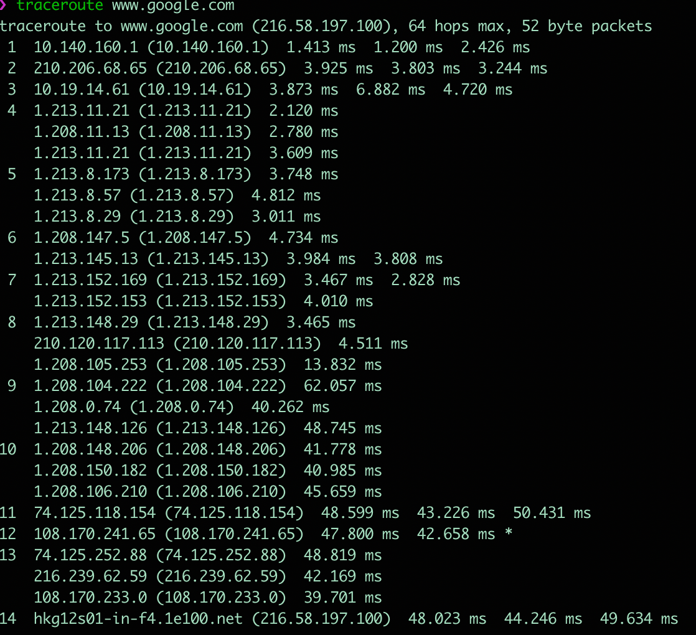
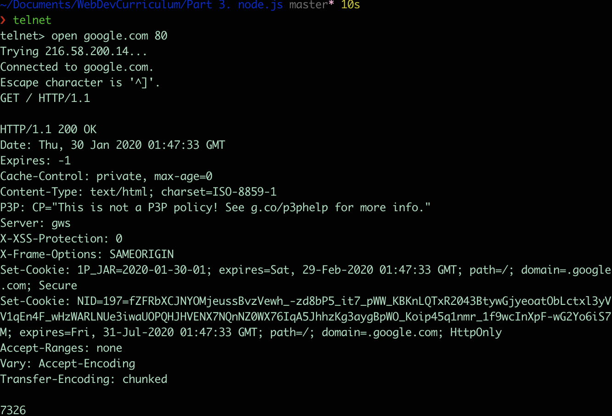

# Quest 09. What is Server

2020. 01. 28

## Topics

### 1. Server, Client, Web Browser

클라이언트 / 서버는 두 개의 컴퓨터 프로그램 사이에 이루어지는 역할 관계를 나타내는 것이다.

* 클라이언트 : 다른 프로그램에게 서비스를 요청하는 프로그램 / 시스템
* 서버 : 요청에 대해 응답, 서비스를 제공 해주는 프로그램 / 시스템
* 웹 브라우저 : 인터넷 상 어딘가에 위치한 웹 서버에게 웹페이지나 파일의 전송을 요구하는 클라이언트 프로그램

### 2. Protocols

통신 프로토콜은 서로 다른 기기들 간의 데이터 교환을 원활하게 수행할 수 있도록 표준화시켜 놓은 통신 규약이다. 통신 프로토콜은 통신을 제어하기 위한 표준 규칙과 절차의 집합으로 하드웨어와 소프트웨어 문서를 모두 규정한다.

인터넷을 사용하기 위한 프로토콜은 TCP/IP (Transport Controll Protocol / Internet Protocol)

통신 프로토콜의 기본 요소는 3가지로 구성되는데

* 구문 : 전송하고자 하는 데이터의 형식, 부호화, 신호 레벨등을 규정한다
* 의미 : 두 기기 간의 효율적이고 정확한 정보 전송을 위한 협조 사항과 오류 관리를 위한 제어 정보를 규정한다.
* 시간 : 두 기기 간 통신속도, 메시지 순서 제어 등을 규정한다.

#### 1) IP

* 송신 호스트와 수신 호스트가 패킷 교환 네트워크에서 정보를 주고받는데 사용하는 정보 위주의 규약.
* 각 패킷의 주소 부분을 처리(주소 지정, 패킷 분할, 패킷 조립)
* 패킷들이 목적지에 정확하게 도달할 수 있게 함
* 비신뢰성과 비연결성이 특징
* 비신뢰성 : 흐름에 관여하지 않으므로 정보가 제대로 갔는지 보장하지 않음
* 비신뢰성과 비연결성을 위해 TCP 프로토콜과 같은 상위 프로토콜을 이용한다.

#### 2) TCP

* 메시지나 파일들을 작은 패킷으로 나누어, 인터넷을 통해 전송하는 일을 수행한다.
* 수신된 패킷들을 원래의 메시지로 재조립 하는 일을 담당한다.
* 신뢰성 있는 연결지향형 프로토콜로, 신뢰성이 있다는 것은 패킷에 대한 오류 처리나 재전송따위로 에러를 복구하는 것
* TCP의 헤더에 붙는 정보가 많음

```
UDP(User Datagram Protocol)
비신뢰성, 비연결성 프로토콜. 패킷을 잃거나 오류가 있어도 대처하지 않는 것으로 TCP에 비해 헤더가 간단하다.

TCP의 안정성을 필요로 하지 않는 애플리케이션의 경우 UDP를 사용한다.
```

#### 3) HTTP

* 애플리케이션 계층 프로토콜
* www 상에서 정보를 주고 받을 수 있는 프로토콜
* TCP와 UDP를 사용하며, 80번 포트를 사용한다
* https의 경우 443 포트를 사용한다.

### 3. DNS

호스트의 도메인 이름을 호스트의 네트워크 주소로 바꾸거나, 그 반대의 변환을 수행할 수 있도록 하기 위해 개발되었다.

DNS는 특정 컴퓨터의 주소를 찾기 위해 사람이 이해하기 쉬운 도메인 이름을 숫자로 된 식별 번호(IP 주소)로 변환해 준다.

컴퓨터 도메인 이름(https://knowre.com)을 IP 주소로 변환하고, 라우팅 정보를 제공하는 분산형 데이터베이스 시스템.

### 4. 인터넷은 어떻게 동작하는가 ? OSI 7 Layer에 입각하여.

이 질문에 대해 대답하기 위해 일단, OSI 7 계층에 대해 이야기를 먼저 해야 할 것 이다.
OSI 7 계층은 란 Open Systems Interconnection 7 Layer로, 통신에 관한 국제 표준 기구인 International Organization for Standardization(ISO) 에서 만든 통신이 일어나는 과정을 7개로 나누어, 단계별 표준화로 효율성을 높이기 위해 나타났다. 

OSI 7계층이 일어나기 전에 통신 기기들은 각각 독자적인 규격으로 통신 장비를 구축하였고, 다른 기기, 회사간 통신에서 많은 비용과 비효율적인 사용 행태가 드러났기 때문에, 이를 규격화 하기 위해 등장했다. 통신 장비들은 반드시 OSI 7 계층을 이룰 필요는 없으며, 해당 장비에 필요한 부분들 만을 선택하여 구성할 수 있다는 장점을 가지고 있다.

OSI 7계층은

* Application Layer
* Presentation Layer
* Session Layer
* Transport Layer
* Network Layer
* Data Link Layer
* Physical Layer

로 구성되어 있다. 이렇게 통신 과정을 단계별로 나누면서 얻게된 장점으로

1. 데이터의 흐름이 한눈에 보이며
2. 문제를 해결하기 편리하다 (상위 레이어를 검사했을 때 통과하면 하위 레이어는 문제 없음)
3. 계층을 나누고 표준화 하여 호환성이 확보된다.

#### 1) 피지컬 계층 (Physical Layer)

* 통신의 맨 아래 단계
* 전기적, 기계적, 기능적인 특성을 이용하여 통신 케이블로 데이터를 전송한다.
* 아날로그 신호를 디지털로, 디지털을 아날로그 신호로 바꾼다.
* 통신 단위는 bit (전기적 on, off 상태)
* 데이터 전송을 주 목적으로 함
* 데이터의 에러, 효율성에 관여 하지 않음
* 통신 케이블, 리피터, 허브

#### 2) 데이터 링크 계층 (Data Link Layer)

* Physical Layer를 통하여 송수신되는 정보의 오류와 흐름을 관리하여 안전한 정보의 전달을 할 수 있도록 도와줌
* 네트워크 계층 패킷 데이터를 물리적 매체에 실어 보내기 위한 계층
* Point to Point간 신뢰성 있는 전송을 보장하기 위한 계층
* 통신에서의 오류도 찾아주고 재전송도 하는 기능
* 맥 어드레스를 가지고 통신할 수 있게 해줌
* 전송 단위는 프레임
* 브리지, 스위치
* Ethernet, ppp

#### 3) 네트워크 계층 (Network Layer)

* 목적지까지 가장 안전하고 빠르게 전달해야 함 (라우팅)
* 경로 선택, 주서 설정, 경로에 패킷 전달
* 라우터, 스위치

#### 4) 트랜스포트 계층 (Transport Layer)

* 주요 기능으로 플로우 컨트롤과 에러 복구 기능
* 에러복구를 위한 패킷 재전송, 플로 조절 => 데이터의 정상적 전송을 목적으로 함
* TCP / UDP 계층
* Gateway

#### 5) 세션 계층 (Session Layer)

* 통신 장치간 상호작용 및 동기화 제공
* 논리적인 연결 담당
* 통신 중 연결이 끊어지지 않도록 유지 시켜주는 역할
* SSH, SSL/TLS

#### 6) 표현 계층 (Presentation Layer)

* 입력, 출력되는 데이터를 하나의 표현 형태로 변환
* 필요한 번역을 수행하여 두 장치가 일관되게 전송 데이터를 서로 이해할 수 있도록 함
* 코드변환, 구문 검색, 데이터 압축 및 암호화 등 기능 수행

#### 7) 응용 계층

* 사용자 인터페이스, 전자우편, DB 관리 등 서비스 제공
* 웹 브라우저
* 통신 가능성을 확인하고, 오류 회복 절차와 데이터 무결성 제어에 대한 동기화 및 설정 수행
* HTTP, FTP, DNS 

### 5. www.knowre.com 을 url 창에 쳤을 때 어떤 과정을 통해 노리의 서버 주소를 알게 되나요?

### Q1) tracert(traceroute) 명령을 통해 www.google.com 까지 가는 경로는?



### Q3) telnet

```
Trying 216.58.220.206...
Connected to google.com.
Escape character is '^]'.
Connection closed by foreign host.
```

여기서 기다리면 나올줄 알았는데, 추가적으로 작업을 진행했어야 했다. 즉, url 로 요청을 하고, 이에 대한 추가 요청(GET, POST 및 프로토콜)을 해야 무언가가 나온다.

이를 위해
```bash
> telnet
tellnet > open google.com 80
GET / HTTP/1.1
```
을 입력하고 엔터를 치면, 구글 문서에 대한 정보를 확인 할 수 있다.

그결과로



IP주소와 함께 연결 성공시 response에 대한 내용을 확인 할 수 있다.